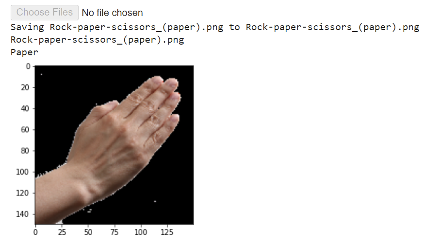

# Rock-Paper-Scissors Classifier using CNN

## Description

This project implements a Convolutional Neural Network (CNN) to classify rock-paper-scissors hand gestures in images. The model is trained using the TensorFlow framework and is able to accurately distinguish between rock, paper, and scissors gestures.

This project is a submission for the [Belajar Machine Learning untuk Pemula](https://www.dicoding.com/academies/184) course on Dicoding.

## Features

- Data Augmentation using ImageDataGenerator to improve model generalization.
- Convolutional Neural Network architecture for image classification.
- Simple interface for uploading images and getting predictions.

## Tech Stack

- Python
- TensorFlow
- Keras
- Google Colab

## Getting Started

Follow these steps to run the project on Google Colab:

1. Open [Google Colab](https://colab.research.google.com/).

2. Click on **File > Open notebook**.

3. Choose the **GitHub** tab and enter the repository URL: [https://github.com/nargyanti/rock-paper-scissors-image-classification](https://github.com/nargyanti/rock-paper-scissors-image-classification)

4. Select the `Submission_Klasifikasi_Gambar_Nabilah_Argyanti_Ardyningrum.ipynb` notebook.

5. Run each code cell sequentially to train the model and make predictions.

## Usage

1. Training the model:

    - Open and run the code cells in the notebook.
    - This section includes code for data preprocessing, model creation, training, and evaluation.

2. Making predictions:

    - Use the code cells from the "Main program" section to upload an image and get a prediction from the trained model.

## Screenshot

